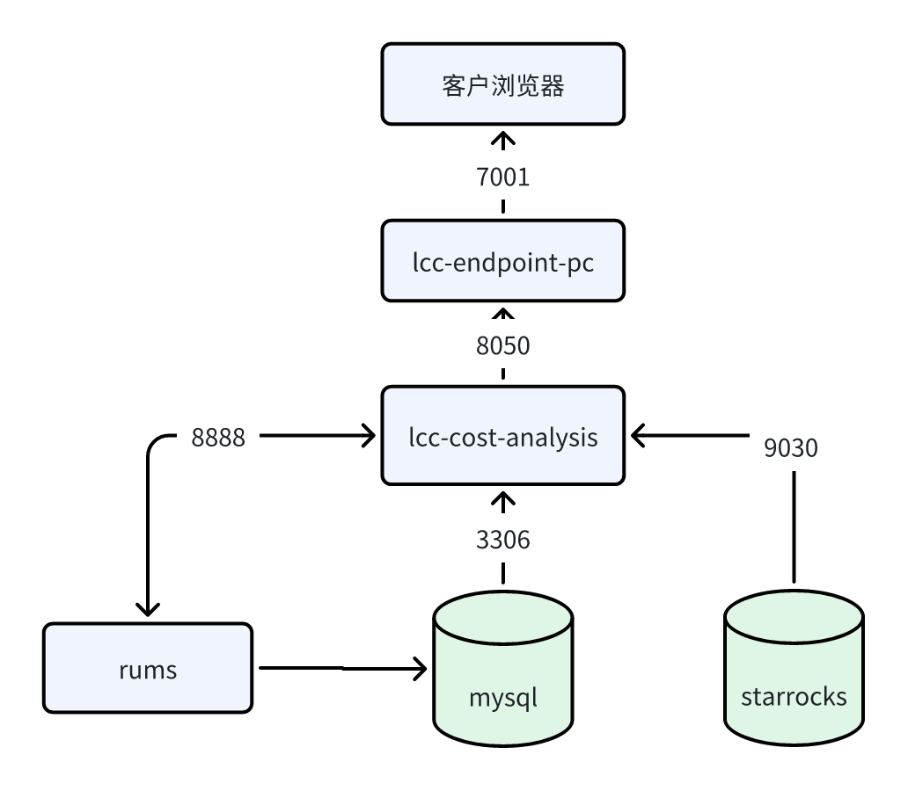
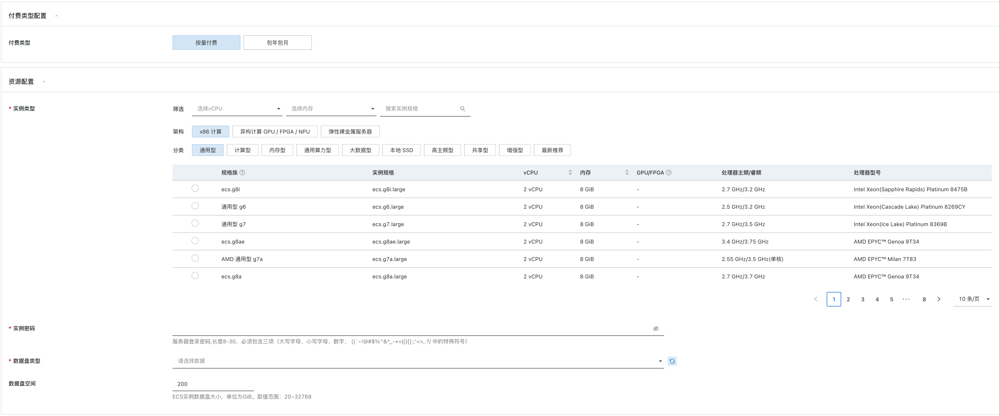

# Sky CostPilot（成本分析）服务实例部署文档

## 概述

`Sky CostPilot是结合TBM（Technology Business Management）理念及FinOps最佳实践的IT成本管理工具。旨在将业务和IT投资结合，看清楚每一笔IT投资，管理层可以更快地进行规划和决策，发现成本优化的机会，让每一笔IT投资都物超所值。`


## 计费说明

```
Sky CostPilot在计算巢上的费用主要涉及：

- 软件授权费用
- 所选vCPU与内存规格
- 系统盘类型及容量
- 公网带宽

计费方式为包年包月，支持按月或按年进行授权
```

## 部署架构



## RAM账号所需权限

`(权限策略内容)`

```
CSGHub服务需要对ECS、VPC等资源进行访问和创建操作，若您使用RAM用户创建服务实例，需要在创建服务实例前，对使用的RAM用户的账号添加相应资源的权限。添加RAM权限的详细操作，请参见[为RAM用户授权](https://help.aliyun.com/document_detail/121945.html)。所需权限如下表所示。
```

| 权限策略名称 | 备注 |
| --- | --- |
| AliyunECSFullAccess | 管理云服务器服务（ECS）的权限 |
| AliyunVPCFullAccess | 管理专有网络（VPC）的权限 |
| AliyunComputeNestUserFullAccess | 管理计算巢服务（ComputeNest）的用户侧权限 |


## 部署流程

### 部署步骤

1. 获取部署链接后，进入服务实例部署页面，根据页面提示，填写参数完成部署
2. 根据需要选择 ecs 规格（建议8C32G）、数据盘类型、数据盘大小（建议200G）

3. 选择 VPC、交换机


### 部署参数说明

`(部署参数说明内容)`

```
eg:

您在创建服务实例的过程中，需要配置服务实例信息。下文介绍云XR实时渲染平台服务实例输入参数的详细信息。

| 参数组 | 参数项 | 示例 | 说明 |
| --- | --- | --- | --- |
| 服务实例名称 |  | test | 实例的名称 |
| 地域 |  | 华北2（北京） | 选中服务实例的地域，建议就近选中，以获取更好的网络延时。 |
```

### 验证结果

`(验证结果内容)`

```
eg:

1. 查看服务实例。服务实例创建成功后，部署时间大约需要2分钟。部署完成后，页面上可以看到对应的服务实例。 
2. 通过服务实例访问TuGraph。进入到对应的服务实例后，可以在页面上获取到web、rpc、ssh共3种使用方式。
```

### 使用Demo

`(服务使用说明内容)`

```
eg:

请访问Demo官网了解如何使用：[使用文档](https://www.aliyun.com)
```

## 问题排查

`(服务使用说明内容)`

```
eg:

请访问[Demo的问题排查链接](https://www.aliyun.com)获取帮助。
```

## 联系我们

欢迎访问Demo官网（[https://www.aliyun.com](https://www.aliyun.com)）了解更多信息。

联系邮箱：[https://www.aliyun.com](mailto:https://www.aliyun.com)

社区版开源地址：[https://github.com/](https://github.com/)

扫码关注微信公众号，技术博客、活动通知不容错过：

`(添加二维码图片)`
