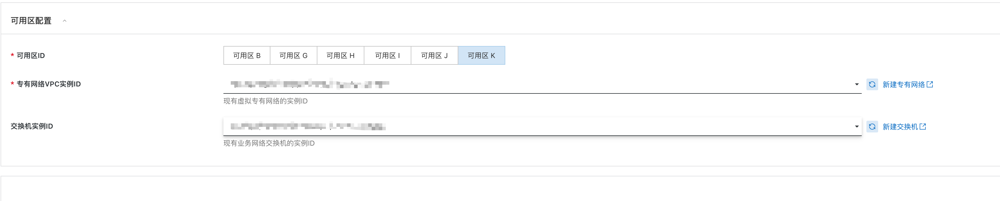

# Sky CostPilot（成本分析）服务实例部署文档

## 概述

`Sky CostPilot是结合TBM（Technology Business Management）理念及FinOps最佳实践的IT成本管理工具。旨在将业务和IT投资结合，看清楚每一笔IT投资，管理层可以更快地进行规划和决策，发现成本优化的机会，让每一笔IT投资都物超所值。`


## 计费说明

```
Sky CostPilot在计算巢上的费用主要涉及：

- 软件授权费用
- 所选vCPU与内存规格
- 系统盘类型及容量
- 公网带宽

计费方式为包年包月，支持按月或按年进行授权
```

## 部署架构


## RAM账号所需权限

`(权限策略内容)`

```
CSGHub服务需要对ECS、VPC等资源进行访问和创建操作，若您使用RAM用户创建服务实例，需要在创建服务实例前，对使用的RAM用户的账号添加相应资源的权限。添加RAM权限的详细操作，请参见[为RAM用户授权](https://help.aliyun.com/document_detail/121945.html)。所需权限如下表所示。
```

| 权限策略名称 | 备注 |
| --- | --- |
| AliyunECSFullAccess | 管理云服务器服务（ECS）的权限 |
| AliyunVPCFullAccess | 管理专有网络（VPC）的权限 |
| AliyunComputeNestUserFullAccess | 管理计算巢服务（ComputeNest）的用户侧权限 |


## 部署流程

### 部署步骤

1. 获取部署链接后，进入服务实例部署页面，根据页面提示，填写参数完成部署
2. 根据需要选择 ecs 规格（建议8C32G）、数据盘类型、数据盘大小（建议200G）

3. 选择 VPC、交换机


### 使用说明
1. 根据下方信息联系贝联珠贯，获取登录账号及License
2. 部署完成后，通过公网IP或ECS实例的内网IP访问 Sky CostPilot 服务。
3. 登录 Sky CostPilot 服务后，页面会自动跳转到 License 注册页面，按照页面提示完成 License 注册。
4. 完成 License 注册后，即可使用 Sky CostPilot 服务。可以关注贝联珠贯微信视频号获取产品demo或联系我们。

## 联系我们

欢迎访问贝联珠贯官网（[https://www.lccomputing.com/](https://www.lccomputing.com/)）了解更多信息。

扫码关注微信公众号，技术博客、活动通知不容错过：


